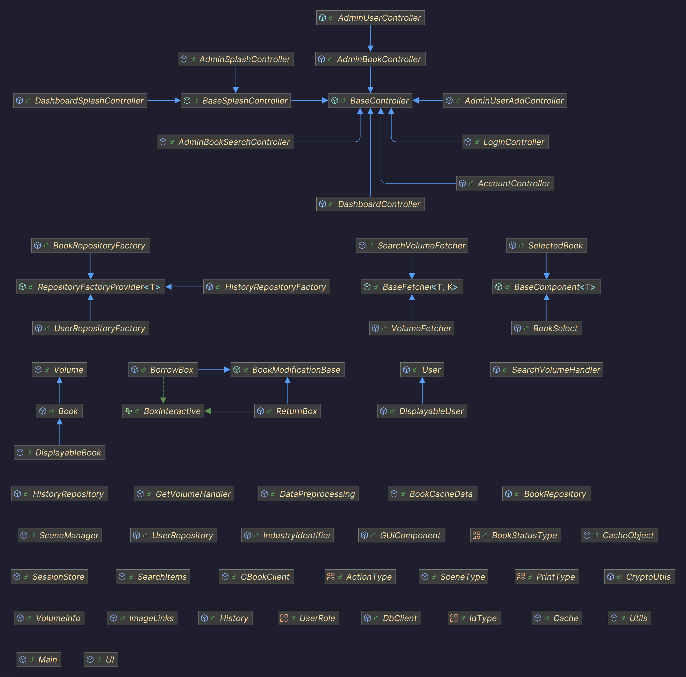

# majutsu

A Certain Magical Index (basically a library management system)

# Project overview

This project is a desktop app allowing you to manage your library. Books' information is fetched from Google Books APIs,
user information is stored in a local database.

The reason why we use a local database for now is to utilize the low latency access time compared to using a remote
database, which unnecessarily increases the complexity of the program as well as the development time.

# Features

- User login
- Borrow/return books
- Change user information
- Admin panel for privileged users
- Finding books using Google Books API

# Collaborators

- Đỗ Trần Thái An (24021349): Backend developer (Project leader)
  - Code reviewer
  - Database design for user access and management
  - App structure designer
- Trần Quý Đạt (24021406): Frontend developer
  - Design and develop UI layouts
  - Caching module development
  - Algorithm optimization
- Nguyễn Phan Việt Hưng (24021502): Backend developer
  - Database design for document management
  - SQL query optimization

# License

This project is licensed under MIT License

# Demo

Click the image above to watch the demo video.

# Inheritance tree

